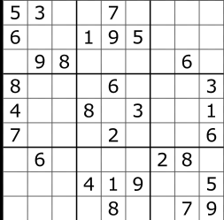
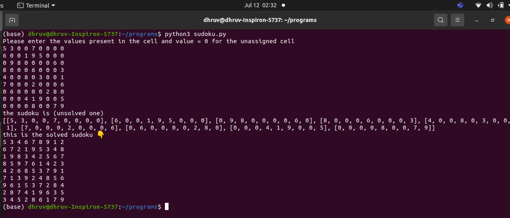

## Script Name
Sudoku Solver Using Backtracking 

## Aim
To write a program for Solving any sudoku where the values of the cells are given by the user.

## Purpose

To get a understanding about the backtracking algorithm.

## Short description of package/script

- It is a python program of Backtracking Algorithm. 
- In this the user give the values of the cell and the values of the cell that are unassigned is zero.

## Workflow of the Project

- First a function is order to provide the best solution by using backtracking algorithm.
- Then outside the function user input is taken.
- the final solution is stored in another function which will check that if the solution of   the user entered sudoku exist or not

## Detailed explanation of script, if needed

The popular Japanese puzzle game Sudoku is based on the logical placement of numbers. An online game of logic, Sudoku doesn’t require any calculation nor special math skills; all that is needed are brains and concentration.
The goal of Sudoku is to fill in a 9×9 grid with digits so that each column, row, and 3×3 section contain the numbers between 1 to 9. At the beginning of the game, the 9×9 grid will have some of the squares filled in. Your job is to use logic to fill in the missing digits and complete the grid. Don’t forget, a move is incorrect if:

* Any row contains more than one of the same number from 1 to 9
* Any column contains more than one of the same number from 1 to 9
* Any 3×3 grid contains more than one of the same number from 1 to 9

### Algorithm 
Create a recursive function that takes a grid.
Create a function that checks after assigning the random value the grid becomes unsafe or not. If any number has a frequency greater than 1 in the grid which is enterd by the user return false else return true.

Check for any unassigned location. If present then assign a number from 1 to 9, and then check that the frequency of the number is not more than 1 in rows and column . If not then return true else return false and then assign another number .
If there is no unassigned location then return true
If suppose we assign a number to the previous cell which satisfy all the sudoku rules , But on the other hand the values remaining for the current cell violates all the rule , then backtracking take place which will remove the value from the previous cell and assign the same value to the current cell and check that if the value satisfy all the constraints or not.

### Example

This is the Random unsolved sudoku  which i took from the internet. There are some empty cells whose values should be written as zero when the user is enter the 81 values (9*9) cells . One individual will take more time to finish the sudoku but my program within a seconds solve the sudoku 

## Output

This is the correct output of the above sudoku.

![] (Images/output_error.png)
output: No solution exist
This will come when the numbers enter by the user has frequency more than one in respective rows and columns . as you can see last column has 1's 2 times

## Author(s)

[Dhruv Varshney](https://github.com/dhruv-varshney)
