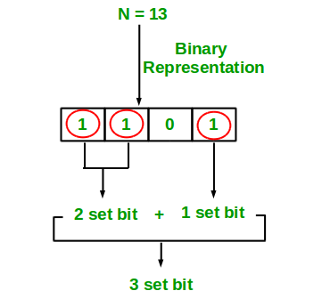
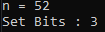
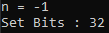

<div align="center"><h1>Count Set Bits in an integer</h1>

</div></br>

Language used : **Python3**</br>
Source code 1 : [python file](https://github.com/NeerajHazarika/PyAlgo-Tree/blob/Count-set-bits-in-an-integer/Bit%20Manipulation/Count%20Set%20Bits%20in%20an%20integer/brute_approach.py) </br>
Source code 2 : [python file](https://github.com/NeerajHazarika/PyAlgo-Tree/blob/Count-set-bits-in-an-integer/Bit%20Manipulation/Count%20Set%20Bits%20in%20an%20integer/brian_kernighans_algo.py)
## 🎯 Aim
To count the number of set bits in an integer

## 🌟 Purpose
To show implemention of counting set bits in an integer of it's binary representation

## 📄 Description
Set bits in a binary number is represented by 1. Whenever we calculate the binary number of an integer value then it is formed as the combination of 0's and 1's. So, the digit 1 is known as set bit in the terms of the computer.

We will discuss two approach : 
1. Brute Force approach - Checking each and every bit of a number's binary representation [O(32)] 
2. Brian Kernighan’s algorithm - Checking only for right most set bits while turning off that bit on each iteration. [O(number of set bits)] 

Example:
```
Input:  n = -1
Output: 32
 
Input:  n = 16 
Output: 1
```

## 🧮 Explanation

1. Brute Force Approach
A simple solution is to consider every bit(set or unset) in a number and maintain a counter to keep track of the set bits.

```
# Naive solution to count the total number of set bits in `n`
def countSetBits(N):
    count = 0
    
    for i in range(32):
        if(N & (1 << i)):
            count += 1
    return count
 
 
if __name__ == '__main__':
    n = int(input("n = "))
    print("Set Bits :",countSetBits(n))
```

2. Brian Kernighan's algorithm :
In this approach we check only for right most set bits on each iteration and turning off the right most set bit after incrementing counter. So that in the next iteration loop will consider the next right most set bit. 

We can do this by `n&(n-1)` using AND operation between itself(n) and 1 subracted from itself(n-1). (n-1) changes all the 0s after right most set bits to 1 and changes itself(right most set bit) to 0. After the AND operation between them the result is switch of right most set bit on n to 0. 

Consider an example for 52 :
```
1st iteration of the loop: n = 52
 
00110100    &               (n)
00110011                    (n-1)
~~~~~~~~
00110000
 
 
2nd iteration of the loop: n = 48
 
00110000    &               (n)
00101111                    (n-1)
~~~~~~~~
00100000
 
 
3rd iteration of the loop: n = 32
 
00100000    &               (n)
00011111                    (n-1)
~~~~~~~~
00000000                    (n = 0)
```

This is the Python implementation of Brian Kernighan's algorithm :
```
# Brian Kernighan's algorithm to count the total number of set bits in `n`
def countSetBits(n):
 
    count = 0
    while (n):
        n &= (n-1)
        count+= 1
     
    return count
 
if __name__ == '__main__':
    n = int(input("n = "))
    print("Set Bits :",countSetBits(n))
```

Note : Unfortunately, Brian Kernighan's algorithm wont work for negative numbers in python implementation. Although it works in [c/c++ implementation](https://www.geeksforgeeks.org/count-set-bits-in-an-integer/).

## 💻 Input and Output 
- **Test Case 1 :**



- **Test Case 2 :**



## ⏰ Time and Space complexity
- **Time Complexity of brute force algo:** `O(32)`. 
- **Time Complexity of brian kernighan's algo:** `O(no. of set bits)`. 

## Author
Neeraj Pratap Hazarika [@NeerajHazarika](https://github.com/NeerajHazarika)

[](https://www.python.org/)
