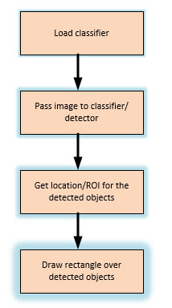
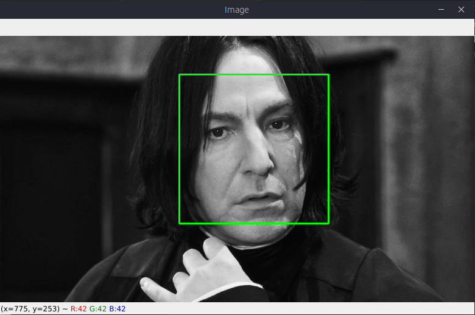

# Face Detection

## Aim

The aim of the program given is to detect object of interest(face) in real time and to keep tracking of the same object. This is a simple example of how to detect face in Python.

## Purpose

- The purpose is to Build A Real-Time Face Algorithm used to identify faces in an image or a real time video.
- The algorithm uses edge or line detection features proposed by Viola and Jones in their research paper “Rapid Object Detection using a Boosted Cascade of Simple Features” published in 2001.

## Short description of package/script

- Face Recognition is a technology in computer vision. In Face recognition / detection we locate and visualize the human faces in any digital image.
- The __OpenCV GitHub repository__ has the models stored in XML files, and can be read with the OpenCV methods.
- These include models for face detection, eye detection, upper body and lower body detection, license plate detection etc.
- In this project, I applied face detection to some photos from Harry Potter using OpenCV with Python.

## Workflow of the Project

For the classier, we have used packages contain Haar cascade files. cv2.data.haarcascades

## Detailed explanation of script, if needed

If code is not explainable using comments, use this sections to explain your script

## Setup instructions \& Execution

1. Make sure you have Python 3.7 and a text editor installed.
2. Install the required packages using pip install -r requirements.txt.
3. In the main directory Run `python3 face_detection.py` or `python face_detection.py`.
4. Enter the path of the file.

## Sample Test Cases

Some Results of the program:

## Author(s)

Kushal Borkar
