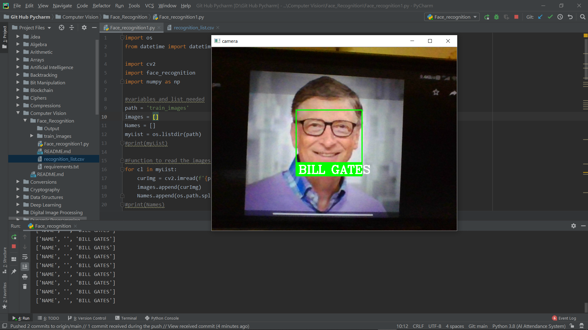
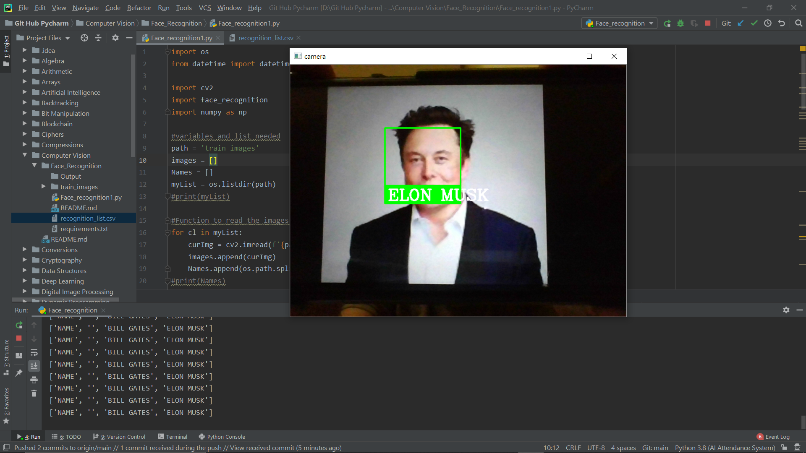
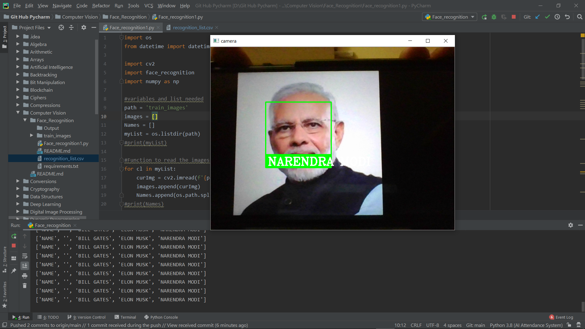

# Face-Recognition-System
- Face recognition is a method of identifying or verifying the identity of an individual using their face. Face recognition systems can be used to identify people in photos, video, or in real-time.
- Face recognition systems use computer algorithms to pick out specific, distinctive details about a person’s face. These details, such as distance between the eyes or shape of the chin, are then converted into a mathematical representation and compared to data on other faces collected in a face recognition database.

## Aim
To develop a Face Recognition System using openCV and record the Name and Time of the person's apperance in front of the camera.

## Purpose
The purpose is to Build A Real-Time Face Recognition End-To-End Project.

## Short Description
- This project is done with this fantastic “Open Source Computer Vision Library”, the OpenCV.
- OpenCV
        - OpenCV was designed for computational efficiency and with a strong focus on     real-time applications. So, it’s perfect for real-time face recognition using a camera.
 Documentation-  <https://docs.opencv.org/master/>

## Workflow of the Project
* There are 4 phases in this project.
    - Face Detection and Data Gathering
    - Train the Recognizer
    - Face Recognition 
    - Record Name and Time in an external CSV file.

* Working Block Diagram

         
 ## Execution 
 - OpenCV Installation On windows 
 <code>pip install opencv-python</code> 
 - Import the package 
 <code>import cv2</code> 

All packages contain Haar cascade files. cv2.data.haarcascades can be used as a shortcut to the data folder.  
For example: 
<code>cv2.CascadeClassifier(cv2.data.haarcascades + "haarcascade_frontalface_default.xml")</code> 
- Download the Source code, open in Pycharm IDE and configure the scripy file under the python interpreter
- Run the script

 ## Output:
- Demo 1  

- Demo 2 

- Demo 3 

- CSV data 
        - Name and time

## Author
[Sanjay N T](https://github.com/sanjay-nt)
:Date: 2021-08-04

