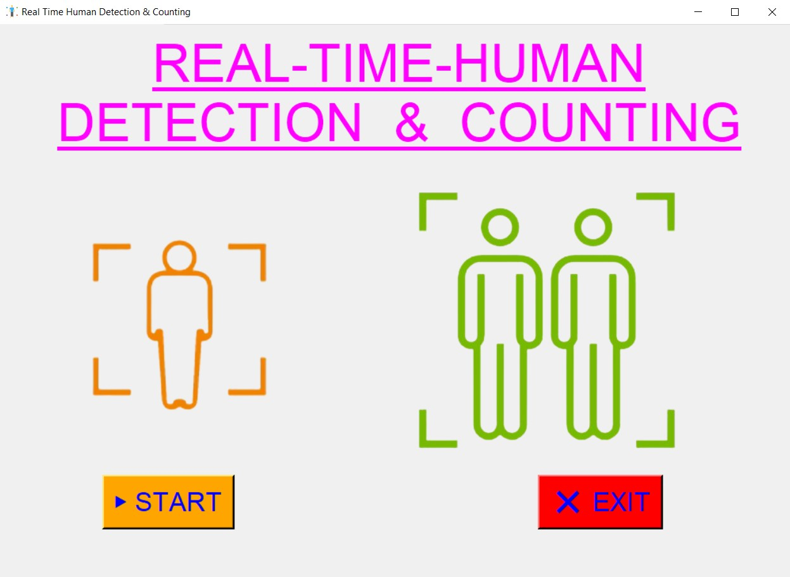
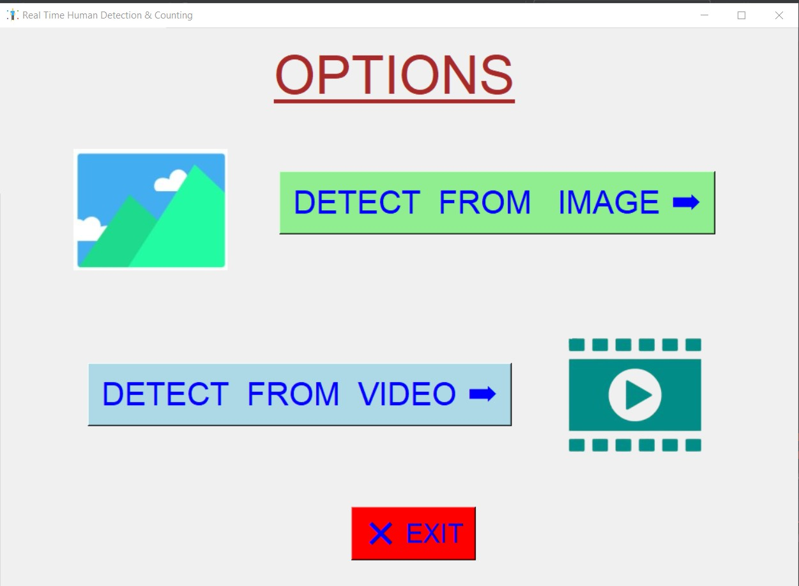
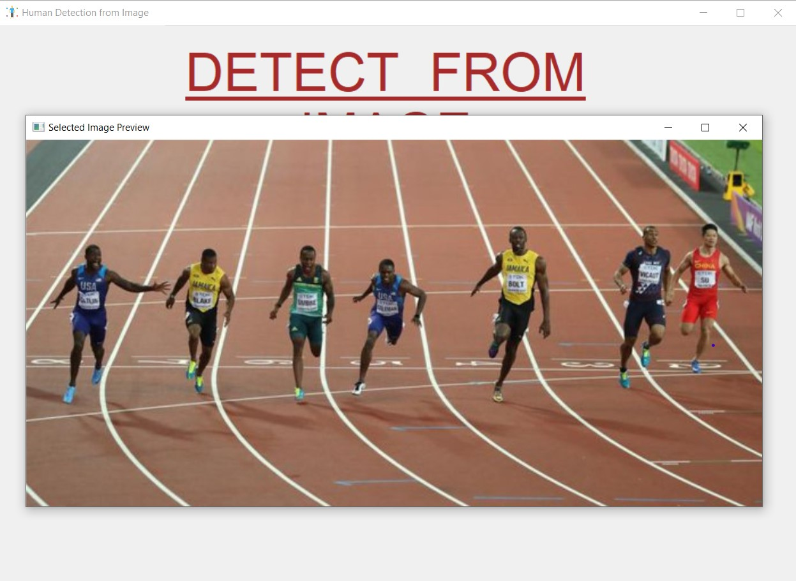
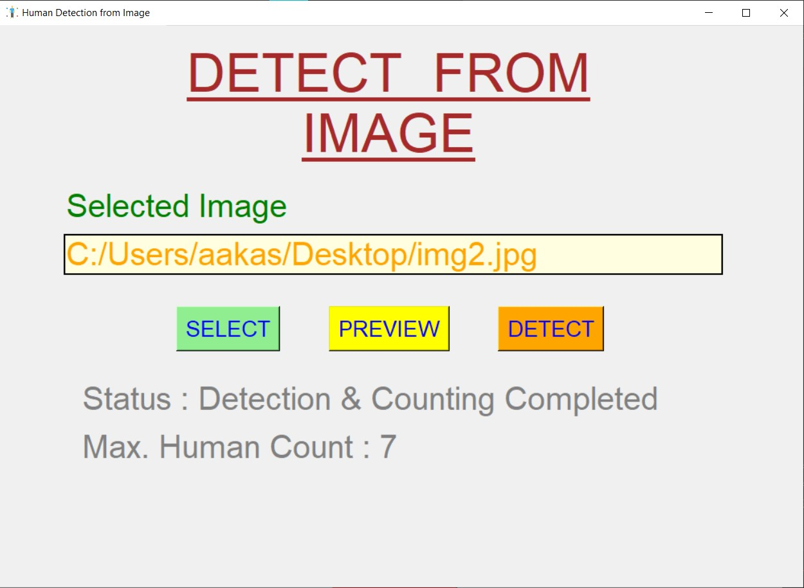
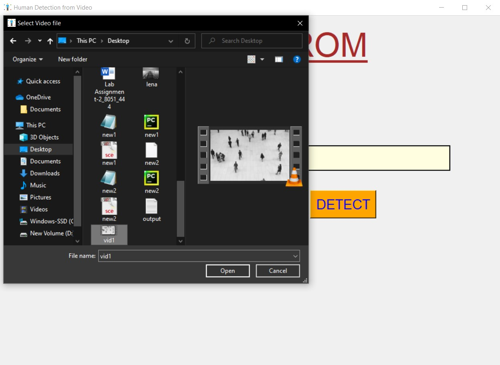
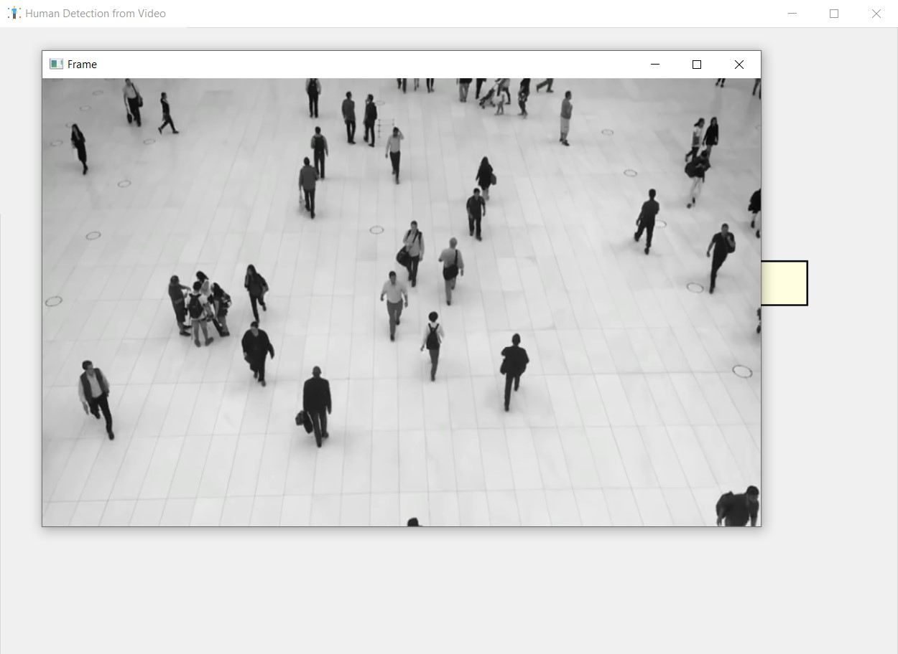
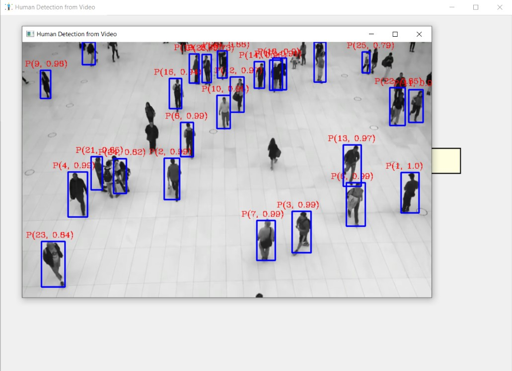
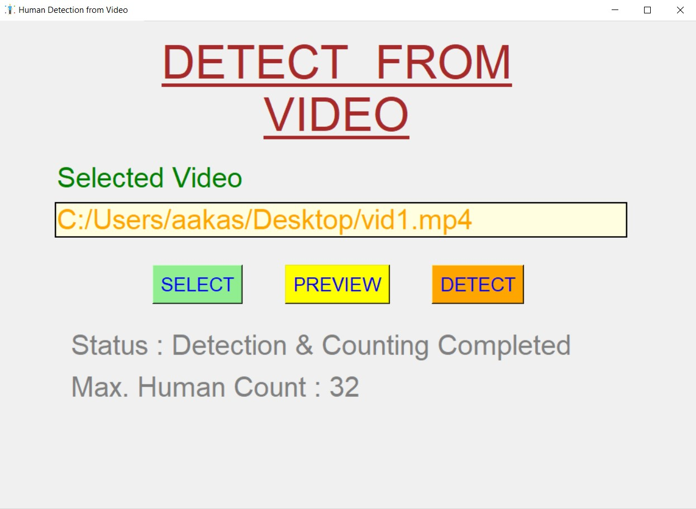

# ✔ HUMAN DETECTION AND COUNTING
- #### It is a python script created with tkinter gui and computer vision.
- #### Using this user will be able to detect the humans in the image and real time video.
- #### User will also be able to see the preview while detection process is going on.
- #### It also keeps track of the total no. of people detected and displays the max people count at the end.

****

## REQUIREMENTS :
- #### python 3
- #### tkinter module
- #### from PIL import Image, ImageTk
- #### os
- #### cv2
- #### argparse
- #### numpy
- #### tensorflow
- #### time

****

## HOW TO Use it :
- #### User just need to download the file, and run the human_detection_and_counting.py, on local system.
- #### After running a GUI window appears, user can start the main application using START button.
- #### Here user will be able to see the option like detect from images or video.
- #### After use has selected any of the both option, a new window will open and there user need to select the respective file using SELECT button.
- #### user can also preview the selected file using PREVIEW button, and inorder to setect humans from that file, DETECT button needs to be selected.
- #### After the detection process is complete user will be displyed the total no. of max. people count in the respective selected files.
- #### Also there is exit button, clicking on which we get a exit dialog box asking the permission to exit.

## Purpose :
- #### This scripts helps user to easily detect and count the total no. of max. people count in the images or video.

## Compilation Steps :
- #### Install tkinter, PIL, os, cv2, argparse, numpy, tensorflow, time
- #### After that download the code file, and run human_detection_and_counting.py on local system.
- #### Then the script will start running and user can explore it by selecting any image or video, and detecting the humans from it.

****

## SCREENSHOTS :

****

   
   
   
   
   
   
   
   
   

****

## Author : 
- #### Akash Ramanand Rajak
