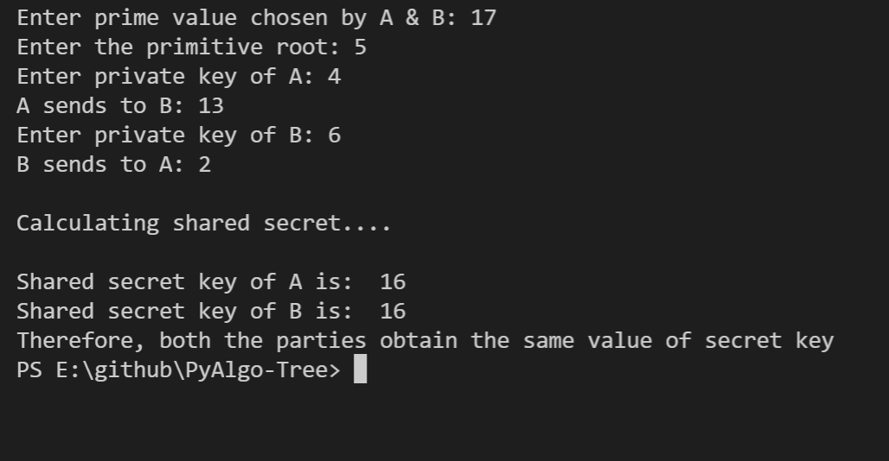
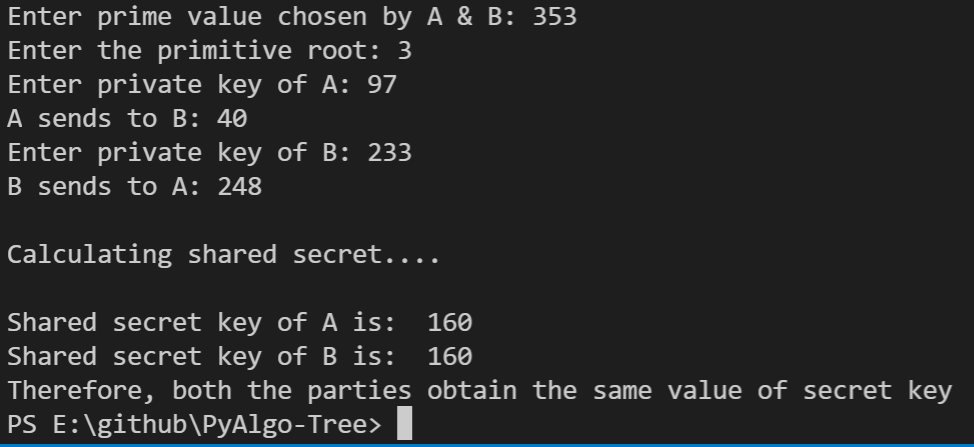

# DIFFIE HELLMANN KEY EXCHANGE ALGORITHM 

## Aim

The Diffie–Hellman (DH) Algorithm is a key-exchange protocol that enables two parties communicating over public channel to establish a mutual secret without it being transmitted over the Internet. 

## Purpose

To create an algorithm of diffie-hellmann key exchange

## Short description of package/script

- The problem is solved using diffie-hellmann key exchange algorithm
- We use Python to solve this

## Workflow of the Project

*Explaination of Diffie Hellmann*

Algorithm of Diffie Hellmann
1. Alice wants to communicate with Bob they must agree large prime number i.e. p & q
2. Alice selects secret large random integer number a and calculate A i.e A= q^(a) mod p
3. Alice sends this A to Bob
4. Bob independently selects another secret large random no b and calculate B i.e B= q^(b)mod p
5. Bob sends the number B to Alice
6. Alice is calculating his secret key Ak i.e Ak= B^(a) mod p
7. Bob is calculating his secret key Bk i.e Bk= A^(b) mod p
8. If Ak = Bk then Alice and Bob can agree for future communication called as Key agreement.
9. We have Ak = Bk = K

## Compilation Steps
To run the script, simply type **python diffie_hellman.py** in the command prompt
After the script is run, follow the steps provided below:
- Enter the prime number which is decided by the two parties
- enter the primitive root
- enter private key of party1 and party2. Now both of them calculates their public key and send these numbers to each other
- Both the parties calculate the value of secret key at their respective side.
- After calculating, if they get both same shared secret key, they can communicate safely

## Output

## Author

[Dilrose Reji](https://github.com/dilroseR/)