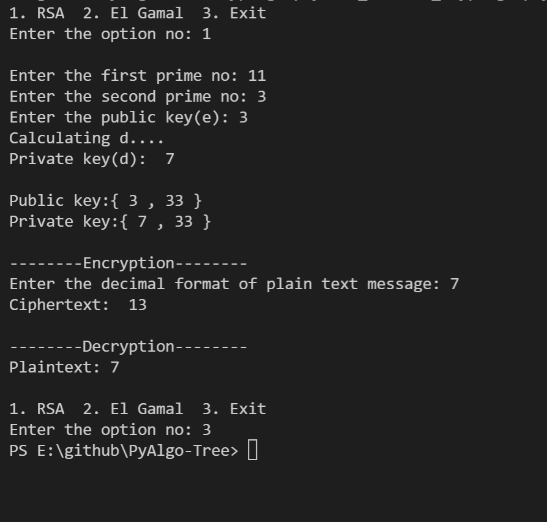
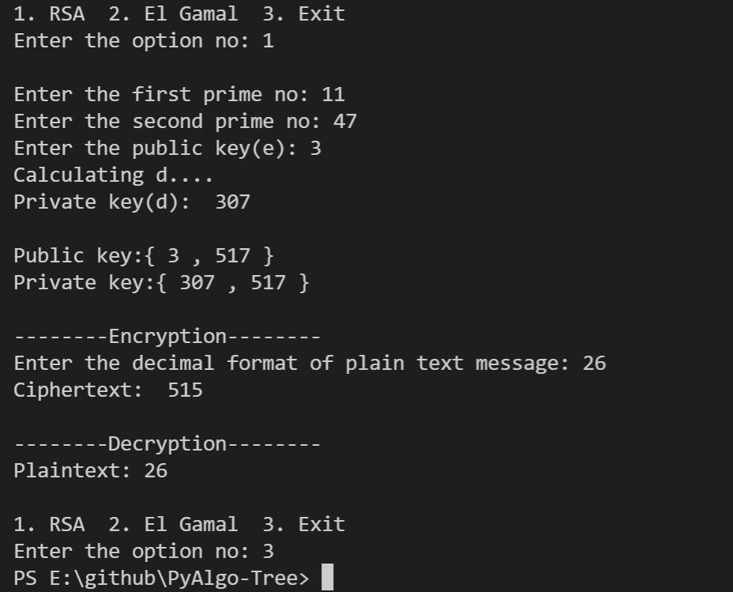
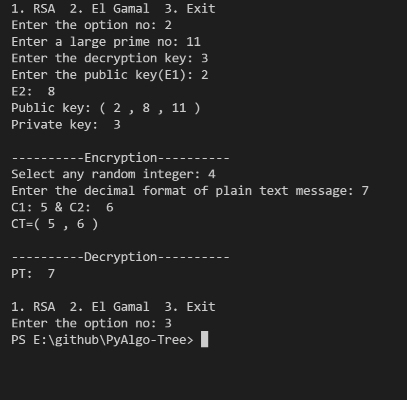
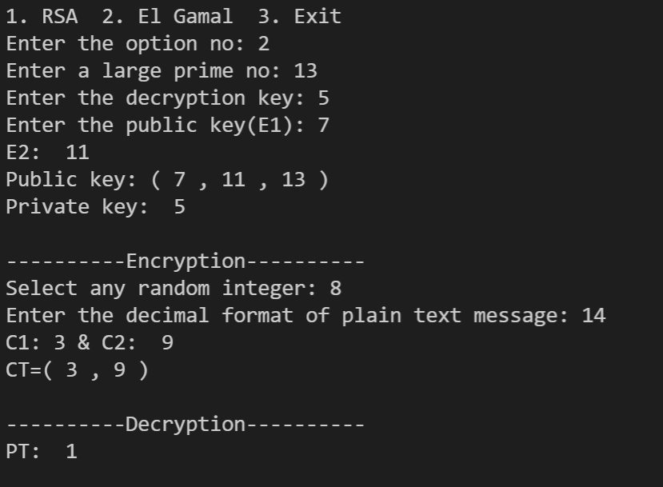

# RSA & El-GAMAL CRYPTOGRAPHY

## Aim

Cryptography is associated with the process of converting ordinary plain text into unintelligible text and vice-versa. It is a method of storing and transmitting data in a particular form so that only those for whom it is intended can read and process it.
A simple algorithm which will convert a plaintext into cipher text and vice-versa using encryption and decryption respectively.

## Purpose

To create a Encryption/Decryption program using RSA & El-Gamal cyptosystems

## Short description of package/script

- The problem is solved using RSA & El-Gamal cyptography
- We use Python to solve this

## Workflow of the Project

*Explaination of RSA*

Algorithm of RSA:-
1. Select two Prime numbers p & q where p ≠ q
2. Calculate n =p*q
3. Calculate ø(n) = (p-1)*(q-1)
4. Select e such that , e is relatively prime to ø(n)
   i.e. gcd (e, ø(n)) = 1 and 1<e< ø(n)
5. Calculate d= e^(-1) mod ø(n) or ed mod ø(n)=1
6. Public key = {e , n} , Private key ={d , n}
7. Find out Cipher text using C= P^(e) mod n where P<n,
   C= Cipher text, P=plaintext , e= Encryption Key and n= Block size.
8. P= C^(d) mod n plaintext can be obtained using given formula
   where d= Decryption Key

*Explaination of El-Gamal*

Algorithm of El-Gamal:-
1. Key generation
        a) Select large prime number (P)
        b) Select decryption key /private key (D)
        c) Select second part of encryption key or public key (E1)
        d) Third part of encryption key or public key (E2) E2=E1^(D) mod p
        e) Public key =(E1,E2,p),Private key =D
2. Encryption
        a) Select random integer R
        b) C1= E1^(R) mod p
        c) C2=(PT X E2^(R)) mod p
        d) CT=(C1,C2), CT=ciphertext
3. Decryption
        a) PT =(C2 X (C1^(D))^(-1)) mod p

## Compilation Steps
To run the file, type **python rsa_elgamal.py** in the command prompt
After the script is run, enter:

Choose what you want to do rsa or el-gamal or quit:
1. If you proceed with rsa then follow the steps provided below:-
    
    - Decide 2 large prime numbers and enter them
    - Enter the public key[e] number (Public key is known to everybody which can be used to encrypt messages)
    - After that, a private key is generated according to the algorithm of step 5
    - Then you need to provide the value of plaintext which will then convert to ciphertext according to step 7
    - And finally the ciphertext would be decrypted to plaintext according to step 8
    
2. If you proceed with el-gamal then follow the steps provided below:-
    - Decide a large prime number and enter it (P)
    - Enter the decryption key(D)
    - Enter 1st public key (E1)
    - Then E2 is generated according to step 1 d) of el-gamal algorithm
    - Therefore we get the public key i.e (E1,E2,P) 
    - For encryption, enter a random number which will then be used to calculate C1 [from step 2 b)]
    - Then provide in the value of plaintext to calculate C2 and hence we will get ciphertext
    - For decryption, we will get plaintext according to step 3 a)
       

## Output

## Author

[Dilrose Reji](https://github.com/dilroseR/)