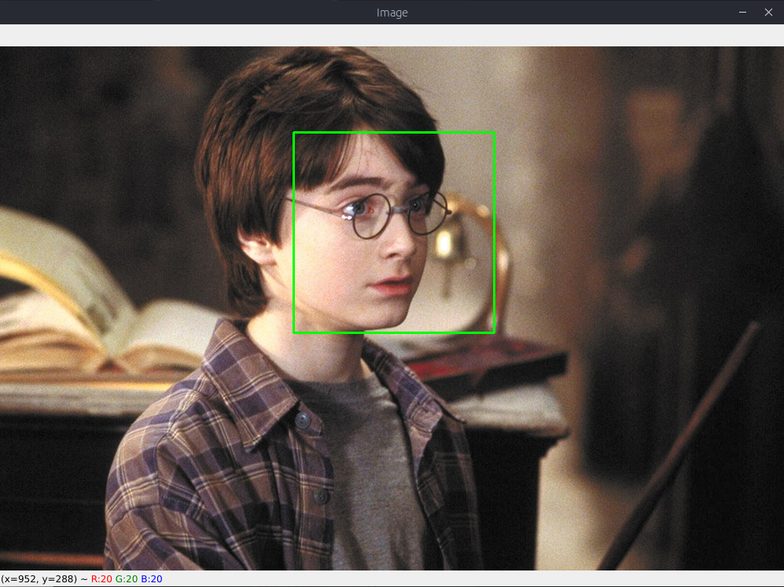

# Face Detection with Haar Cascade

---

Face detection is one of the fundamental applications used in face recognition that determines the locations and sizes of human faces in arbitrary (digital) images. It detects only the facial features.

---

### What is Haar Cascade?

It is an Object Detection Algorithm used to identify faces in an image or a real time video. The algorithm uses edge or line detection features proposed by Viola and Jones in their research paper “Rapid Object Detection using a Boosted Cascade of Simple Features” published in 2001.

The __OpenCV GitHub repository__ has the models stored in XML files, and can be read with the OpenCV methods. These include models for face detection, eye detection, upper body and lower body detection, license plate detection etc.

In this project, I applied face detection to some photos from Harry Potter using OpenCV with Python.

---

### Steps

1. Make sure you have Python 3.7 and a text editor installed.
2. Install the required packages using pip install -r requirements.txt.
3. In the main directory Run `python3 face_detection.py` or `python face_detection.py`.
4. Enter the path of the file.

---

### Results

Some Results of the program:

