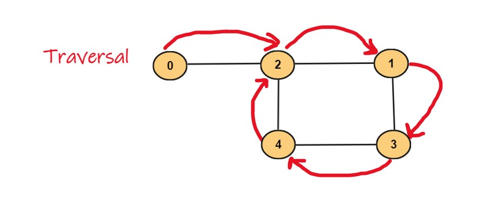

## Overview:
Two techniques are frequently used for graph traversal: These techniques are called **depth-first search (DFS)** and **breadth-first search (BFS)**, although we will just talk about DFS. DFS involves diving deep into the graph and then backtrack when it reaches the bottom.

## What is Depth First Search in Python?
In DFS, *we continue to traverse downwards through linked nodes until we reach the end*, then retrace our steps to check which connected nodes we haven't visited and repeat the process. In depth-first search, we dive deep into the graph and then backtrack when we reach the bottom.

## Algorithm of DFS in Python
Every time we reach a new node, we will take the following steps:
1. We add the node to the top of the stack.
2. Marked it as visited.
3. We check if this node has any adjacent nodes:
    1. If it has adjacent nodes, then we ensure that they have not been visited already, and then visited it.
    2. We removed it from the stack if it had no adjacent nodes.

## Time & Space Complexity
* **Time Complexity:**
Time complexity of DFS is `O(V+|E|)`, where V is the number of vertices and E is the number of edges.
* **Space Complexity:**
The space complexity of the DFS algorithm is `O(V)`, where V is the number of vertices.

## Input & Output:
 

### Input:

```python
graph = {
        0: [2],
        1: [2, 3],
        2: [0, 1, 4],
        3: [1, 4],
        4: [2, 3]
    }
 ```
 
 ### Output:
 ```python
 Depth-first search: [0, 2, 1, 3, 4]
 ```
  
