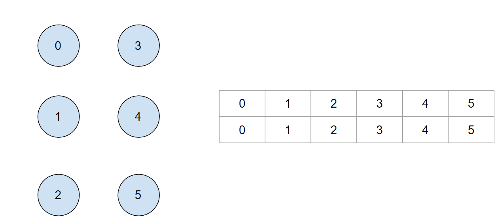
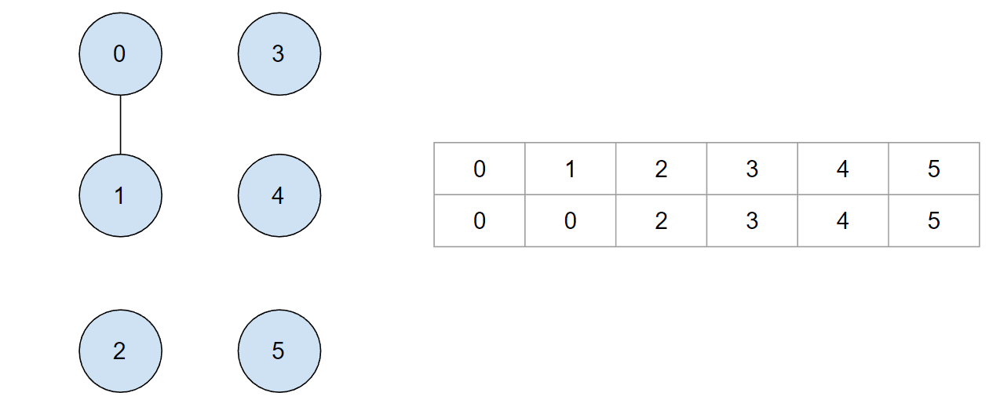
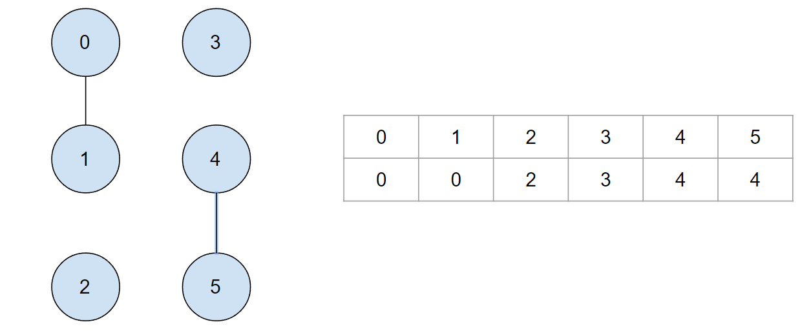
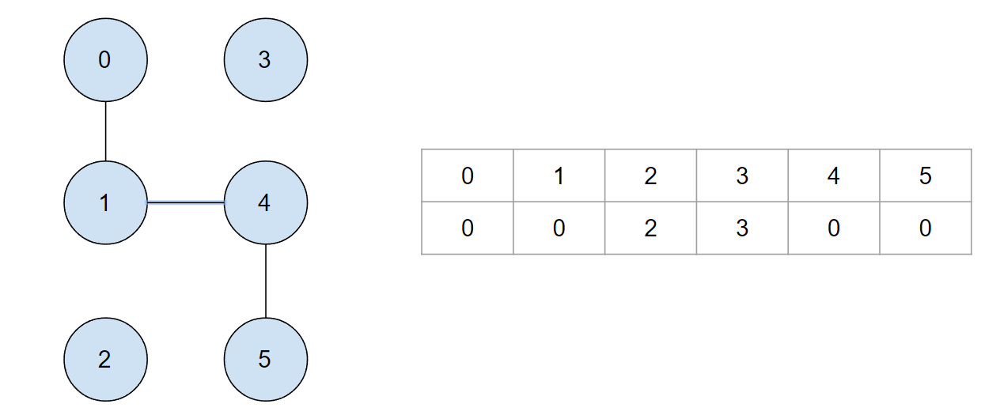

## Overview:
A way that we can easily check membership in an undirected graph is through the use of UnionFind aka. Disjoint Set. 
The word Union Find and Disjoint Set are relatively interchangable within the coding world with Disjoint Set reffering to 
the data structure and Union Find referring to the actual algorithm. This data structure plays an especially important role in Kruskal's algorithm for finding a minimum spanning tree as it can 
help determine if an undirected graph contains any cycles.

## What is a Disjoint Set (Union Find)?
A Disjoint set is essentially an undirected graph. It's a datastructure that stores a collection of disjoint (non-overlapping) sets. 
It stores a subsection of a set into disjoint subsets. 
The basic operations are as follows:

### Find()
Find the root of a given disjoint subset 

```python
    def find(self, a): 
        while a != self.root[a]: 
            a = self.root[a]
        return a 
```

### Union()
Combine subsets into a larger subset 
```python 
    def union(self, x, y):
        rootX = self.find(x)
        rootY = self.find(y)
        if rootX != rootY:
            for i in range(len(self.root)):
                if self.root[i] == rootY:
                    self.root[i] = rootX
```

At the initialization of a disjoint set each element represents a separate subset with its parent being the element itself. 

This is what's called the root array. 


## Algorithm of UnionFind in Python
Every time we reach a new node, we will take the following steps:
1. Call find(x), and find(y) to find the root of each of the subsets, with x and y representing the elements to combine. 
2. Loop through entire root array and update the root of y with the root of x

## Time & Space Complexity
* **Time Complexity:**
Time complexity of the basic UnionFind algorithm is `O(N)`, for find and `O(N)` for union, where N is the number of elements

However, depending on the uitilization of this algorithm it often can scale to `O(N^2)` as you often times find yourself doing 
N operations of Union.


* **Space Complexity:**
Since the initialization array is of length N. 

The space complexity of the UnionFind algorithm is `O(N)`, where N is the number of elements

## Input & Output:

At the start each element is the root of itself. 
```python
uf = UnionFind(6)
 ```
 

```python
uf.union(0,1)
 ```
When we call the union function we update the root of one element to the root of the other.

 

```python
uf.union(4,5)
 ```




```python
uf.union(1,4)
 ```

 This also applies to all subsequent elements with the same root

  

