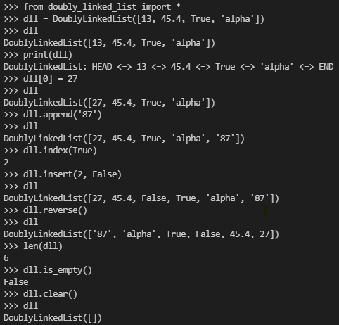
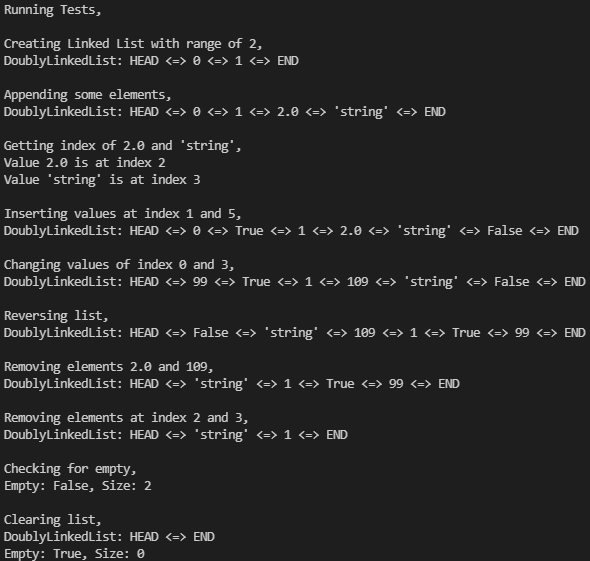

# Doubly Linked List

## Aim

To implement Doubly Linked List data structure in Python.


## Purpose

The purpose is to create an alternative data structure to array.
Also acheive faster insertion and deletion. And to traverse in both
direction in list.


## Short Description

Linked List:
- Linked List is a collection of nodes that are connected through their references.
- It is an alternative data structure to array.
- Linked List provides insertion and deletion in O(1) time and dynamic size allocation.

Doubly Linked List:
- In Doubly Linked List every nodes are bi-directionally connected with each other.
- In this, first node's previous and last node's next are points to None.


## Workflow of the Project

- This script contains a class named DoublyLinkedList which manages the linked list.

* The DoublyLinkedList class contains,
    - Class,
        - _Node: Used to store data.
    - Methods,
        - append(), 
        - clear(), 
        - extend(), 
        - index(), 
        - insert(), 
        - is_empty(),
        - pop(), 
        - remove(), 
        - reverse(). 

+ In our Doubly Linked List implementation, we use 'HEAD' and 'END' dummy nodes known sentinels.
+ This sentinels ensures every addition and deletion operation done between 'HEAD' and 'END' nodes.
+ And it is also avoids some special cases in operation.
+ Also, we're declaring node class as protected inside main class.


## Setup Instructions

Import the script by,

```
from doubly_linked_list import *
```
OR
```
import doubly_linked_list
```

After import create an instance of Doubly Linked List.
```
variable = DoublyLinkedList()
```
OR
```
variable = doubly_linked_list.DoublyLinkedList()
```

And start the work on it, That's all ✌️


## Sample Test Cases

```python
>>> from doubly_linked_list import *
>>> dll = DoublyLinkedList([13, 45.4, True, 'alpha'])
>>> dll
DoublyLinkedList([13, 45.4, True, 'alpha'])
>>> print(dll)
DoublyLinkedList: HEAD <=> 13 <=> 45.4 <=> True <=> 'alpha' <=> END
>>> dll[0] = 27
>>> dll
DoublyLinkedList([27, 45.4, True, 'alpha'])
>>> dll.append('87')
>>> dll
DoublyLinkedList([27, 45.4, True, 'alpha', '87'])
>>> dll.index(True)
2
>>> dll.insert(2, False)
>>> dll
DoublyLinkedList([27, 45.4, False, True, 'alpha', '87'])
>>> dll.reverse()
>>> dll
DoublyLinkedList(['87', 'alpha', True, False, 45.4, 27])
>>> len(dll)
6
>>> dll.is_empty()
False
>>> dll.clear()
>>> dll
DoublyLinkedList([])
```


## Output

Output of above test case,



Output of test case inside file,



## Author

[NanthaKumar](https://github.com/nknantha)
