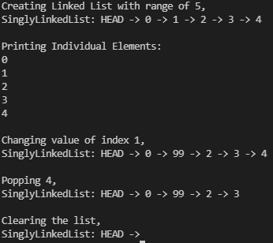

# Singly Linked List

## Aim

To implement Singly Linked List data structure in Python.


## Purpose

The purpose is to create an alternative data structure to array.


## Short description of script

- Linked List is a collection of nodes that are connected through their references.
- In Singly Linked List every node points the next node. Last node points to None.
- Linked List provides insertion and deletion in O(1) time and dynamic size allocation.
- It is an alternative data structure to array.


## Workflow of the Project

- This script contains a class named SinglyLinkedList. It manages the linked list.

* The Singly Linked List class contains,
    - Class,
        - _Node: Used to store data.
    - Methods,
        - append(), 
        - clear(), 
        - extend(), 
        - index(), 
        - insert(), 
        - pop(), 
        - remove(), 
        - reverse(). 

+ On the outer appearance it exactly act as Python's Built-in List.


## Setup instructions

Import the script by,

```
from singly_linked_list import *
```
OR
```
import singly_linked_list
```

After import create an instance of Singly Linked List.
```
variable = SinglyLinkedList()
```
OR
```
variable = singly_linked_list.SinglyLinkedList()
```

And start the work on it, That's all ✌️


## Sample Test Cases

```python
>>> from singly_linked_list import *
>>> s = SinglyLinkedList([11, 22, 33, 44, 55, 66, 77])
>>> s
SinglyLinkedList([11, 22, 33, 44, 55, 66, 77])
>>> s.append(2.0)
>>> s
SinglyLinkedList([11, 22, 33, 44, 55, 66, 77, 2.0])
>>> s.insert(0, True)
>>> s
SinglyLinkedList([True, 11, 22, 33, 44, 55, 66, 77, 2.0])
>>> s.pop(3)
33  
>>> s
SinglyLinkedList([True, 11, 22, 44, 55, 66, 77, 2.0])
>>> s.remove(66)
>>> s
SinglyLinkedList([True, 11, 22, 44, 55, 77, 2.0])
>>> s.index(2.0)
6
>>> repr(s)
'SinglyLinkedList([True, 11, 22, 44, 55, 77, 2.0])'
>>> str(s)
'SinglyLinkedList: HEAD -> True -> 11 -> 22 -> 44 -> 55 -> 77 -> 2.0 -> END'
>>> s.clear()
>>> print(s)
SinglyLinkedList: HEAD -> END
```


## Output




## Author

[NanthaKumar](https://github.com/nknantha)
