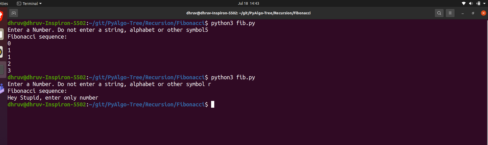

## Script Name
 To print Fibonacci series till the number n Using Recursion 

## Aim
To write a program for getting a fibonacci series till input n where the value of n is defined by the user.

## Purpose

To get a understanding about the recursive algorithm.

## Short description of package/script

- It is a python program of recursive Algorithm. 
- In this the user give the input which can be any form a number either positive or negative , a symbol or a string and for each type of input appropriate message is generated..

## Workflow of the Project

- First a function is there which will take the number as a paramter and check that the number is either 0 or 1 or more and return appropriate output . 
- Then outside the function user input is taken.
- Outside the function program will check that the input entered is a psotive number or negative number or something else.
- If the input is negative then it will stop the execution by displaying a messsage that "its a negative number". If the input is positive then it will display the fibonacci series else it will    
  print message that say you should enter only number.
- Run the project by the command "python3 fib.py".

## Detailed explanation of script, if needed
The Fibonacci numbers are the numbers in the following integer sequence.
0, 1, 1, 2, 3, 5, 8, 13, 21, 34, 55, 89, 144, ……..

In mathematical terms, the sequence Fn of Fibonacci numbers is defined by the recurrence relation 
Fn = Fn-1 + Fn-2
with seed values F0 = 0 and F1 = 1.

### Algorithm 
- Create a recursive function that takes a number as its parameter.
- in the recursive number (in my program Fibonacci is the recursive function) first it will check that the number is either 0 or 1 , if the number is zero then it will return 0 and if the number is 1 
  then it will return 1 .
- in other condition it will follow the sequence Fn = Fn-1 + Fn-2 and it wil terminate till the number is 2.
- outside the function it will check the given input is positive number or negative number or something else. if the input is negative number or some other random symbol or string then function will 
  not be executed in these case .And if the number is positive number then by using for loop the complete fibonacci series is printed till the number n.

## Output

## Author(s)

[Dhruv Varshney](https://github.com/dhruv-varshney)
