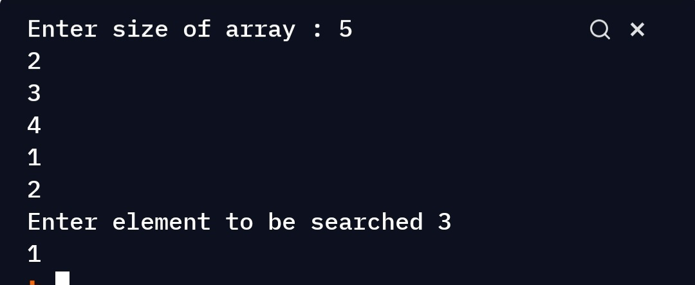

# First index of an element in an array.  

## Aim

The aim is to create a python code to get first index  of an element in an array.

## Purpose

The purpose is to come up with an efficient solution while implementing recursion.

## Short description of project
The program takes 3 inputs.
1.size of array.
2.Array elements.
3.Elements whose occurrence is to be found.

## Workflow of the Project
* We will divide the array into 2 parts.
1.The first element.
2. THE remaining elements.
*We will work on first element and recursion will work on rest.
* First we define the base case which will be if length of array =0 return -1.
* Now we will check if our first element is equal to the element whose occurrence is to be checked.
* If yes then we will return 0.
* If no then we we call recursion on other part of array.

## Required libraries

None

## Compilation Steps
Run the script, after that :
  
 1. User is prompted to enter size of array followed by array elements and number whose occurrence is to be checked.
 2. First index on which the element occurred is printed.

# Sample Input and output
## Sample Input 1
5
2 3 5 1 2
2

## Sample output 1
0

## Sample Input 1
6
1 7 1 2 3 2
5

## Sample Output 2
-1

# Output

## Author
[Siddhi Bhanushali](https://github.com/siddhi-244)
