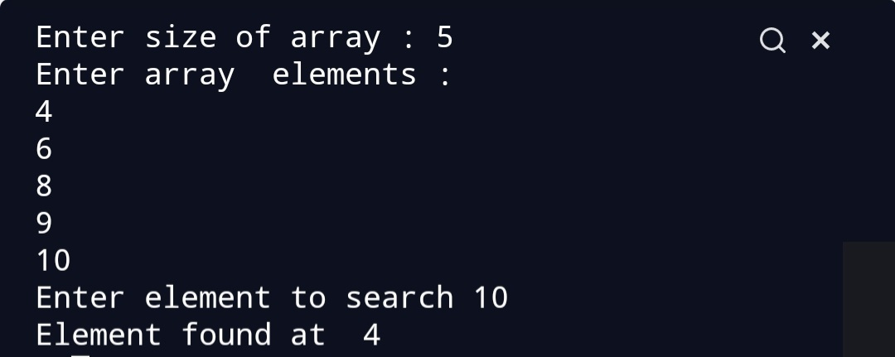

## Script Name
Binary Search Algorithm. 

## Aim
To write a program for Binary search.


## Purpose

To get a understanding about binary search.


## Short description of package/script

- It is a python program of binary search Algorithm. 
- It is written in a way that it takes user input.


## Workflow of the Project

- First a function is written to perform Bubble sort.
- Then outside the function user input is taken.


## Detailed explanation of script, if needed
Binary search is another searching algorithm which is more
effective than the linear Search. Searching algorithms are 
used to search a desired element in an array.Binary Search does 
less number of comparisons than linear Search,so it is an effective 
algorithm.Binary Search works only on sorted array. It follows 
divide and conquer approach.

## Algorithm 
* The array should be sorted.
* We take 3 variables start,mid and end. Start variables
has the index of 0th element end variable has index of last 
element and mid points to middle element.
* We run a loop until start<=end.
* We check if our desired element is equal to mid element.
* If yes then return mid.
* If desired element is greater than the mid element then
we search in the right array.
* If desired element is less than the mid element then we
search in the left array.
* Else return -1.

### Examples
```
For example let the array be [4,5,8,9,11]
We have to search 9 in the array.
Here, start =0,end=4 and mid=(start+end)/2,mid=2
a[mid]=8 which is not equal to 9
a[mid]<9 hence, start=mid+1
start=3,end=4,mid=(3+4)/2=3
a[mid]=9 which is equal to 9 so we return 3.
```

### Output


### Author(s)
[Siddhi Bhanushali](https://github.com/siddhi-244)
