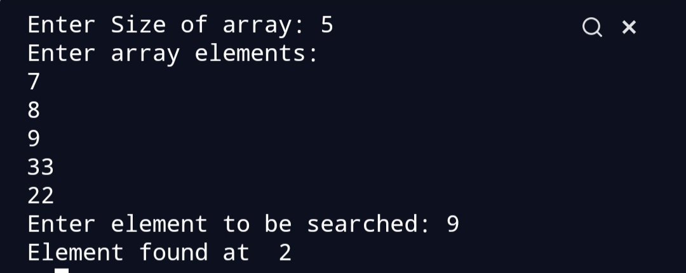

# Script Name
Linear Search Algorithm. 

## Aim
To write a program for Linear search.


## Purpose

To get a understanding about linear search.


## Short description of package/script

- It is a python program for linear search Algorithm. 
- It is written in a way that it takes user input.
- It can be used to search an element from an array,list etc.


## Workflow of the Project

- First a function is written to perform linear Search,which 
traverses the whole array and then finds the element.
- Then outside the function user is prompted to input array size,array
elements and element to be searched.


## Detailed explanation of script, if needed
Linear Search is one of the easiest searching algorithm. 
The main aim of a searching algorithm is to search for a 
desired element in the whole array. Linear Search sequentially 
searches for an element in an array.

## Algorithm 
* In Linear Search, we start from the 0th index of the array,
we compare each element with the key (desired element).

* If the key is same as the element of array ,we return the index
of that element.

* If the key does not match any element then ,we return -1.


## Examples
```
We need to search 6 in the array.

|1|5|2|0|6|8|     
 |______________ is a[0]==6 no then we move to next element.
   |_____________is a[1]==6 no then we move to next element.
     |___________is a[2]==6 no we move to next element. 
        |________is a[3]==6 no we move to next element.
           |_____is a[4]==6 yes ,thus we return 4.
```

## Output


### Author(s)
[Siddhi Bhanushali](https://github.com/siddhi-244)
