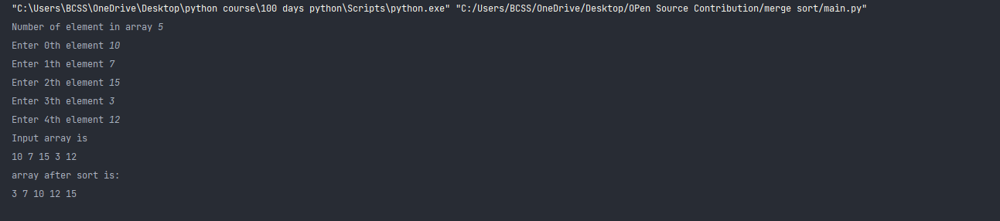

## Script Name
Merge Sort Algorithm. 

## Aim
To write a program for Merge sort.

## Purpose

To get a understanding about Merge sort.

## Short description of package/script

- It is a python program of Merge sort Algorithm. 
- It is written in a way that it takes user input.

## Workflow of the Project

- First a function is written to perform diving array in two halves.
- Then another funtion perform merging of array.

## Detailed explanation of script, if needed
Merge Sort is a Divide and Conquer algorithm. It divides the input array into two halves,
calls itself for the two halves, and then merges the two sorted halves.

### Algorithm 
* Find the middle point to divide the array into two halves:  
             middle m = l+ (r-l)/2
* Call mergeSort for first half:   
             Call merge_sort(arr, l, m)
* Call mergeSort for second half:
             Call merge_sort(arr, m+1, r)
* Merge the two halves sorted in step 2 and 3:
             Call merge_array(arr, l, m, r)
* call the array again using recursion.

## Output

## Author(s)

[Rajpurohit Vijesh](https://github.com/AlexAdvent)
