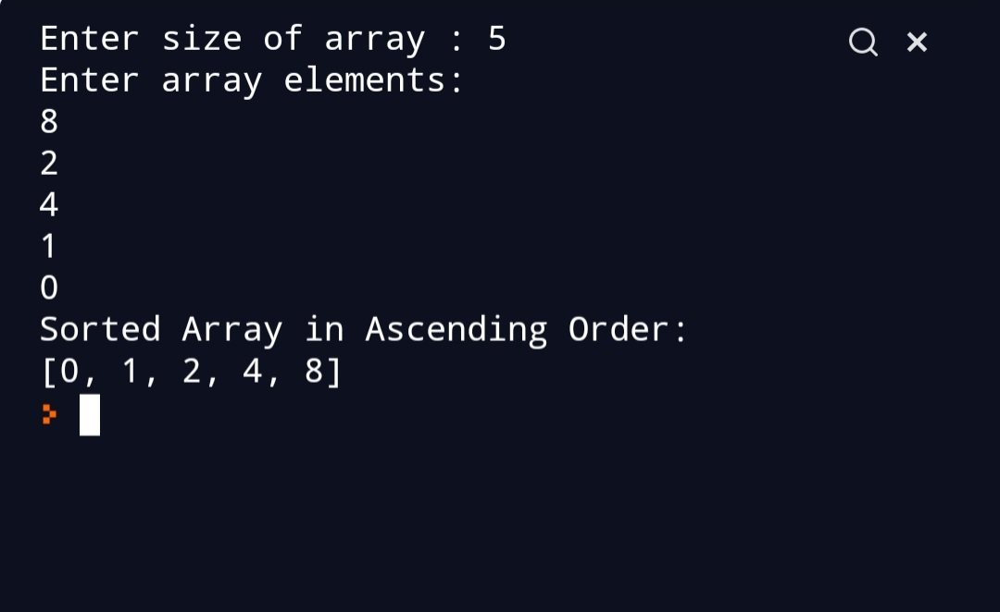

## Script Name
Selection Sort Algorithm. 

## Aim
To write a program for Selection sort.


## Purpose

To get a understanding about selection sort.


## Short description of package/script

- It is a python program of selectiom sort Algorithm. 
- It is written in a way that it takes user input.


## Workflow of the Project

- First a function is written to perform Bubble sort.
- Then outside the function user input is taken.


## Detailed explanation of script, if needed
Selection sort is a sorting algorithm. Sorting algorithm are
used to arrange the array in particular order.It finds the smallest 
element and brings it to the beginning.Two subarrys are maintained.
* The sorted subarray.
* The unsorted subarray.
In every iteration minimum element from the unsorted array is is 
picked and moved to the sorted array.

### Algorithm 
* Set first element as minimum.
* Compare the minimum element with second element and if
the second element is smaller then assign it to minimum.
* Then,go on comparing minimum to the end of array.
* Swap the first element and minimum.
* For next iteration start from the second element as first 
element is already sorted.
* Repeat these steps till array is sorted. 


### Example
```

arr[] =  25 6 10 22 99
1st iteration:
Minimum element is 6 and starting element is 25 so we swap
25 and 6.
The array becomes
arr[]= 6 25 10 22 99

Iteration 2:
Here we start from second element. 
Minimum element is 10 and starting element is 25 so we swap
10 and 25.
arr[]= 6 10 25 22 99 

Iteration 3:
Here we start from 3rd element. 
Minimum element is 22 and starting element is 25 so we swap
25 and 22.
arr[]=6 10 22 25 99

Hence,our array is sorted.
## Setup instructions
Just clone the repository .
```

## Output



## Author(s)

[Siddhi Bhanushali](https://github.com/siddhi-244)
