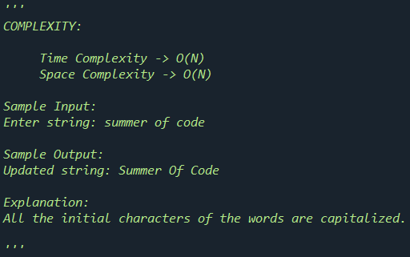

# Capitalizing 

## Aim

To replace the first character of all the words with their upper case characters.

## Purpose

The purpose is to explore string functions like slicing.

## Short description of package/script

- The user enters a string consisting of space separated words.
- The string is sliced on the basis of spaces and the first letter of each word is capitalized.

## Workflow of the Project

- According to all the spaces in the string, words in the string are split.
- First letter of each word is then capitalized using `capitalize()` function.
- Updated string is then printed out.

## Compilation Steps

After the script is run, enter:

1. Enter the string.

That's it! First letter of all the words in the string is capitalized.

## Output

 

## Author

[Manasi Chhibber](https://github.com/Manasi2001)
