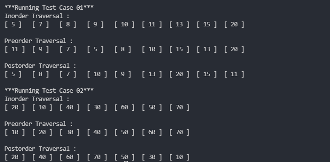

# Inorder, Preorder, and Postorder Traversal of Tree

## Aim:
    The aim is to write a python code to show Inorder, Preorder, and Posrorder Traversal of Tree.

## Purpose:
    The purpose is to come up with an recursive solution of traversals.

## Short description of progarm:
    The project defines and form a binary tree, 
    which then is passed to the functions, to print the respective traversal of the tree.

## Workflow of the program:
    Description of functions used in the code and their purpose:

    Node --> Class, to define node of the binary tree, has data, left, and right as attributes

    inorder --> Function, takes in tree root, and prints the Inorder Traversal of the Tree.

    preorder --> Function, takes in tree root, and prints the Preorder Traversal of the Tree.

    postorder --> Function, takes in tree root, and prints the Postorder Traversal of the Tree.

## Required libraries:
    None

## Compilation Steps:
    Run the script, after that:

    1. The tree is made manually here, to focus on traversal part.
    2. The program is then run to print the Inorder, Preorder, and Postorder traversal of the tree.

# Output

--- Contributed with 🧡 by <a href = "https://github.com/motasimmakki">Motasim</a> ---
